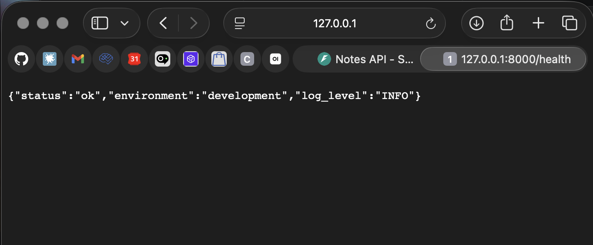
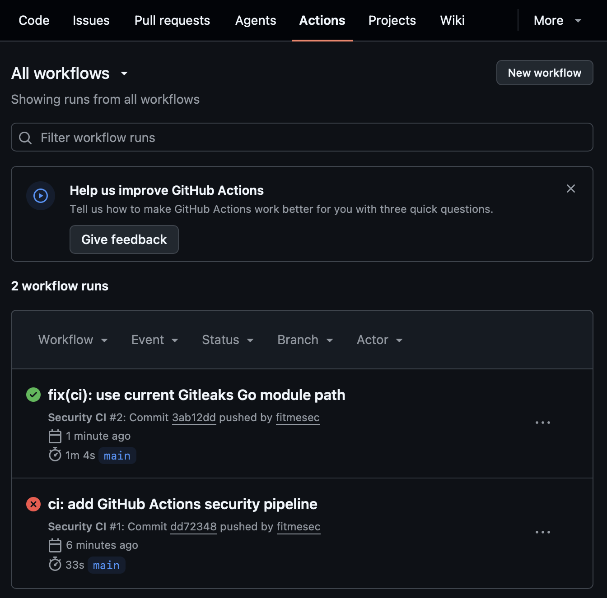
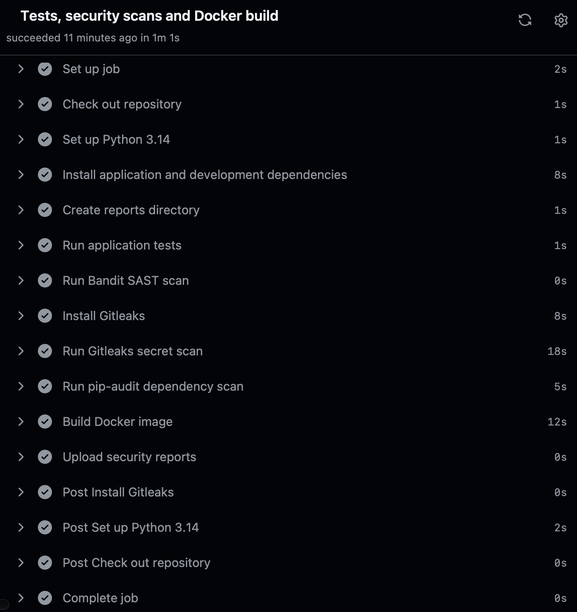
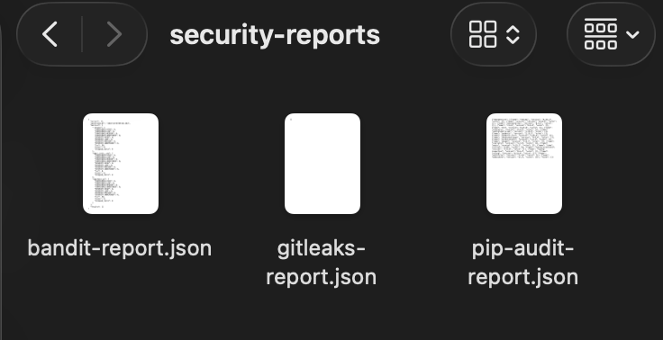

# Secure CI/CD Pipeline for Python Application

Учебный DevSecOps-проект: FastAPI-веб-приложение с CI-пайплайном в GitHub Actions.

Pipeline автоматически запускает тесты, SAST-анализ Bandit, поиск секретов Gitleaks, аудит зависимостей `pip-audit` и сборку Docker-образа при каждом `push` и `pull request`.

Проект демонстрирует интеграцию security-проверок в Secure SDLC по принципу **shift left**: потенциальные проблемы проверяются как можно раньше, до merge изменений в основную ветку.

---

## Цель проекта

Цель — показать базовый secure CI-процесс для Python-приложения:

- автоматическое тестирование API;
- статический анализ исходного кода;
- поиск случайно добавленных секретов;
- проверка зависимостей на известные уязвимости;
- воспроизводимая сборка приложения в Docker;
- сохранение security-отчётов как GitHub Actions artifacts.

Главный объект проекта — CI/security pipeline, поэтому само приложение намеренно небольшое.

---

## Архитектура и стек

### Приложение

Небольшой API заметок на FastAPI:

| Метод | Endpoint | Назначение |
|---|---|---|
| `GET` | `/health` | Проверка доступности приложения |
| `GET` | `/notes` | Получение заметок из памяти |
| `POST` | `/notes` | Создание новой заметки с валидацией входных данных |

Заметки хранятся только в памяти процесса. После перезапуска приложения они удаляются. База данных не используется, так как это не входит в scope версии v1.

### Технологии

| Область | Инструмент |
|---|---|
| Язык | Python 3.14 |
| Web framework | FastAPI |
| ASGI server | Uvicorn |
| Тесты | pytest |
| Контейнеризация | Docker |
| CI | GitHub Actions |
| SAST | Bandit |
| Secret scanning | Gitleaks |
| SCA | pip-audit |

---

## Структура репозитория

```text
secure-cicd-pipeline/
├── .github/workflows/
│   └── security-ci.yml
├── app/
│   ├── __init__.py
│   └── main.py
├── tests/
│   ├── __init__.py
│   └── test_main.py
├── docs/
│   ├── pipeline-overview.md
│   ├── security-tools.md
│   └── screenshots/
├── reports/
├── .dockerignore
├── .env.example
├── .gitignore
├── Dockerfile
├── README.md
├── requirements.txt
├── requirements-dev.txt
└── SECURITY.md
```

---

## Что реализовано

- FastAPI API с endpoint-ами `/health` и `/notes`;
- валидация входных данных для создания заметки;
- 4 автоматических теста через `pytest`;
- Dockerfile с запуском приложения от непривилегированного пользователя `appuser`;
- `.dockerignore` для исключения локальных и ненужных файлов из Docker image;
- GitHub Actions workflow, запускаемый на `push` и `pull request` в `main`;
- SAST-проверка исходного кода через Bandit;
- поиск секретов через Gitleaks;
- аудит зависимостей через `pip-audit`;
- Docker build в CI;
- JSON-отчёты security-инструментов как GitHub Actions artifact `security-reports`.

---

## Pipeline: схема этапов

```text
push / pull request
        |
        v
checkout repository
        |
        v
install Python dependencies
        |
        v
pytest
        |
        v
Bandit (SAST)
        |
        v
Gitleaks (secret scanning)
        |
        v
pip-audit (SCA)
        |
        v
Docker build
        |
        v
upload security reports artifact
```

Подробное описание workflow: [docs/pipeline-overview.md](docs/pipeline-overview.md).

---

## Security checks

### SAST: Bandit

**Bandit** выполняет Static Application Security Testing (SAST): анализирует Python-исходники без запуска приложения.

Инструмент ищет потенциально опасные паттерны, например:

- использование `eval()` и похожих небезопасных конструкций;
- небезопасную десериализацию;
- рискованное использование `subprocess`;
- временные или слабые криптографические решения;
- другие типовые проблемы Python-кода.

Важно: находка SAST — это повод исследовать контекст, а не автоматическое доказательство эксплуатируемой уязвимости.

### Secret scanning: Gitleaks

**Gitleaks** проверяет файлы и Git-историю на возможные секреты:

- API-ключи;
- токены;
- пароли;
- приватные ключи;
- cloud credentials;
- другие чувствительные значения.

Файл `.gitignore` уменьшает риск случайного добавления `.env`, но не заменяет secret scanning. Если рабочий секрет уже попал в Git-историю, удаления файла недостаточно: секрет необходимо отозвать или заменить.

### SCA: pip-audit

**pip-audit** выполняет Software Composition Analysis (SCA): проверяет зависимости из `requirements.txt` и их транзитивные зависимости на известные уязвимости.

Разница между проверками:

| Категория | Что анализирует |
|---|---|
| SAST / Bandit | Собственный исходный код приложения |
| Secret scanning / Gitleaks | Возможные секреты в файлах и Git-истории |
| SCA / pip-audit | Сторонние библиотеки и зависимости |

Подробнее: [docs/security-tools.md](docs/security-tools.md).

---

## Политика блокировки pipeline

В учебной версии проекта применяется строгая политика: если обязательная проверка завершается ошибкой, workflow становится красным и изменения не должны быть merged до исправления или ручного триажа.

| Проверка | Что ищет | Когда блокирует pipeline | Действие разработчика |
|---|---|---|---|
| `pytest` | Регрессии и ошибки поведения | Любой упавший тест | Исправить код или тест |
| Bandit | Рискованные Python-паттерны | Любая находка по текущей конфигурации | Проверить контекст, исправить код или документировать false positive |
| Gitleaks | Секреты в файлах и Git-истории | Любая находка | Удалить секрет, отозвать/ротировать его, перенести значение в GitHub Secrets |
| `pip-audit` | Уязвимые зависимости | Найденная известная уязвимость | Обновить зависимость, проверить совместимость, повторно запустить тесты |
| Docker build | Возможность собрать приложение | Ошибка сборки образа | Исправить Dockerfile, зависимости или build context |

В реальной production-команде пороги блокировки, исключения и сроки исправления зависят от CVSS, эксплуатируемости, критичности сервиса и контекста. Здесь политика намеренно строгая, чтобы продемонстрировать shift left.

---

## Локальный запуск

### 1. Создать и активировать виртуальное окружение

```bash
python3 -m venv .venv
source .venv/bin/activate
```

### 2. Установить зависимости

```bash
python -m pip install --upgrade pip
python -m pip install -r requirements-dev.txt
```

### 3. Запустить приложение

```bash
python -m uvicorn app.main:app --reload
```

После запуска API доступно по адресам:

```text
http://127.0.0.1:8000/health
http://127.0.0.1:8000/docs
```

### Пример ответа `/health`

```json
{
  "status": "ok",
  "environment": "development",
  "log_level": "INFO"
}
```

---

## Запуск через Docker

### Собрать Docker image

```bash
docker build --tag secure-cicd-pipeline:local .
```

### Запустить контейнер

```bash
docker run --rm --name secure-cicd-api -p 8000:8000 secure-cicd-pipeline:local
```

Проверить API:

```bash
curl http://127.0.0.1:8000/health
```

Проверить пользователя внутри контейнера:

```bash
docker exec secure-cicd-api whoami
```

Ожидаемый результат:

```text
appuser
```

Контейнер запускается не от `root`, а от отдельного непривилегированного пользователя.

---

## Запуск проверок локально

### Tests

```bash
python -m pytest -v
```

### Bandit

```bash
python -m bandit -r app -f json -o reports/bandit-report.json
```

### Gitleaks

```bash
gitleaks detect --source . --no-git --report-format json --report-path reports/gitleaks-report.json
```

### pip-audit

```bash
python -m pip_audit -r requirements.txt -f json -o reports/pip-audit-report.json
```

Каталог `reports/` не хранит результаты в Git. В CI эти отчёты создаются заново и публикуются как GitHub Actions artifact `security-reports`.

---

## Примеры результатов

### Локальный Docker-запуск



### Успешный GitHub Actions workflow



### Все этапы CI успешно выполнены



### Содержимое artifact с security-отчётами



---

## Ограничения проекта

Проект реализован как учебный пример и не является production-ready шаблоном.

В текущую версию не входят:

- централизованное хранилище секретов;
- подпись Docker-образов;
- сканирование контейнерных образов;
- DAST-проверки;
- deployment в Kubernetes;
- база данных;
- управление исключениями через security ticketing system;
- SBOM;
- branch protection rules;
- CD и автоматический deployment.

Bandit, Gitleaks и `pip-audit` автоматизируют поиск типовых проблем, но не заменяют ручной code review, threat modeling, оценку архитектурных рисков и контекстный анализ security-находок.

---

## Дальнейшее развитие

Возможные следующие шаги развития проекта:

- добавить сканирование Docker image через Trivy;
- добавить DAST-проверку через OWASP ZAP для тестового контейнера;
- запускать DAST отдельным job после Docker build;
- добавить Software Bill of Materials (SBOM);
- подключить Dependabot;
- настроить GitHub branch protection rules;
- использовать GitHub Secrets для секретов CI/CD;
- публиковать Docker image в GitHub Container Registry;
- добавить IaC и deployment-окружение;
- внедрить policy as code.

---

## Security

Правила ответственного сообщения о потенциальных проблемах описаны в [SECURITY.md](SECURITY.md).
