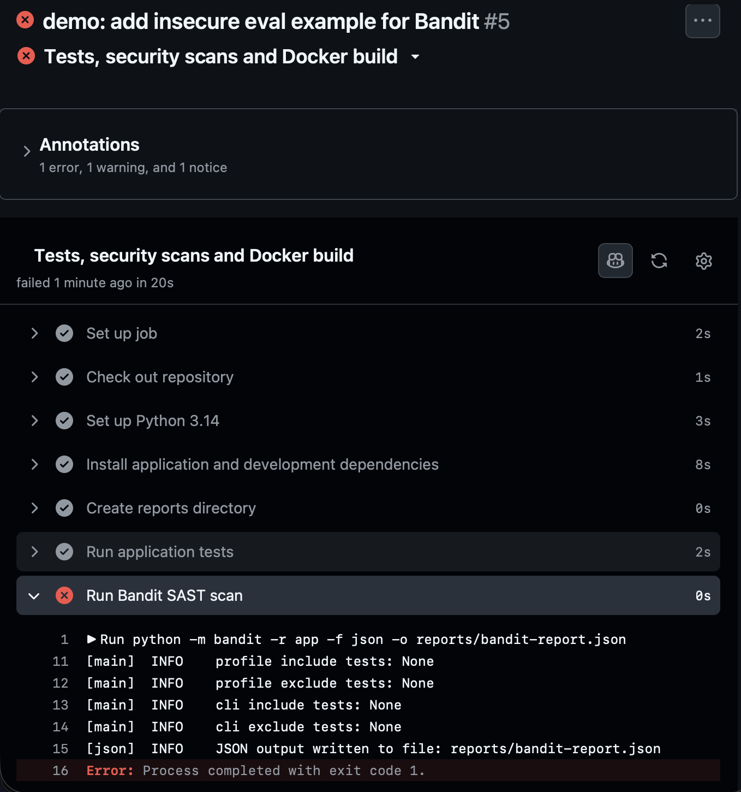
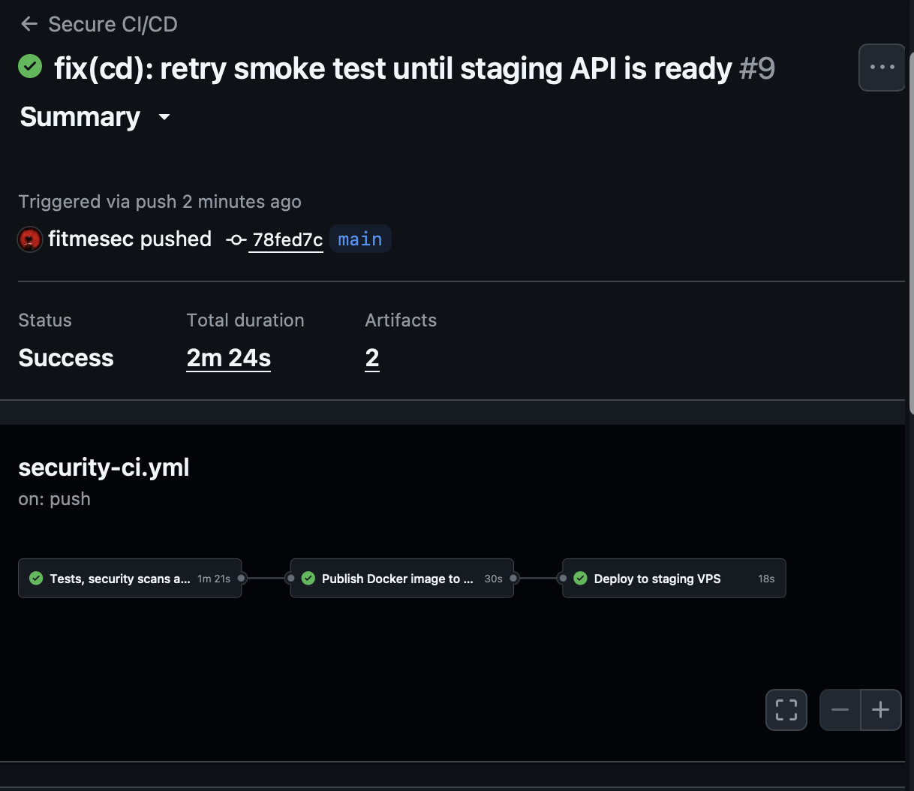
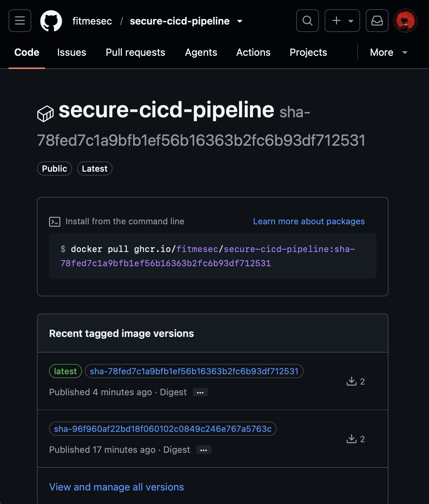
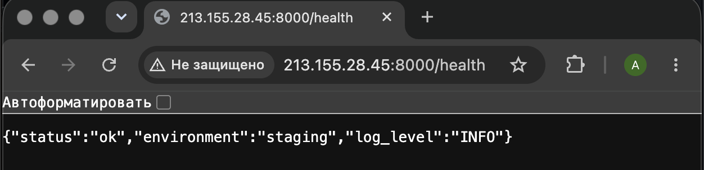

# Secure CI/CD Pipeline for Python Application

Учебный DevSecOps-проект: FastAPI-приложение с Secure CI/CD-пайплайном в GitHub Actions.

Pipeline выполняет автоматические тесты, SAST-анализ Python-кода, поиск секретов, аудит зависимостей, Docker build и сохранение security-отчётов при каждом `push` и Pull Request. После успешного `push` в ветку `main` Docker image публикуется в GitHub Container Registry, автоматически развёртывается на staging VPS и проверяется через endpoint `/health`.

Проект демонстрирует принцип **shift left security**: ошибки и security-риски выявляются на ранних этапах разработки — до merge в основную ветку и до deployment.

---

## Цель проекта

Цель проекта — реализовать воспроизводимый Secure CI/CD-процесс для Python-приложения.

Проект демонстрирует:

- автоматическое тестирование API;
- SAST-анализ Python-кода через Bandit;
- поиск потенциально раскрытых секретов через Gitleaks;
- SCA-аудит Python-зависимостей через `pip-audit`;
- контейнеризацию приложения с Docker;
- запуск контейнера от непривилегированного пользователя;
- публикацию Docker image в GitHub Container Registry;
- автоматический deployment на staging VPS по SSH;
- Docker health-check и внешний smoke test endpoint `/health`;
- блокировку pipeline при обнаружении небезопасного кода;
- сохранение security-отчётов как GitHub Actions artifacts.

Основной фокус проекта — security-процесс, CI/CD и документация. Само приложение намеренно небольшое.

---

## Что реализовано

- FastAPI API заметок;
- `GET /health` для проверки доступности приложения;
- `GET /notes` для получения списка заметок;
- `POST /notes` для создания заметки с валидацией;
- 4 автоматических теста через `pytest`;
- Dockerfile и `.dockerignore`;
- запуск контейнера от пользователя `appuser`, а не от `root`;
- GitHub Actions workflow на `push` и Pull Request;
- Bandit для SAST;
- Gitleaks для secret scanning;
- `pip-audit` для Software Composition Analysis;
- публикация Docker image в GitHub Container Registry;
- deployment в изолированную staging-среду;
- Docker Compose на VPS;
- Docker health-check;
- внешний health-check после deployment;
- JSON-отчёты security-инструментов как workflow artifacts;
- отдельная demo-ветка с небезопасным `eval()`, где Bandit блокирует pipeline.

---

## Технологический стек

| Область | Инструмент |
|---|---|
| Язык | Python 3.14 |
| Веб-фреймворк | FastAPI |
| ASGI-сервер | Uvicorn |
| Тестирование | pytest |
| Контейнеризация | Docker |
| Оркестрация на staging VPS | Docker Compose |
| CI/CD | GitHub Actions |
| Container Registry | GitHub Container Registry |
| SAST | Bandit |
| Secret scanning | Gitleaks |
| SCA / аудит зависимостей | pip-audit |
| Deployment | SSH на Linux VPS |

---

## Приложение

Приложение представляет собой небольшой API заметок с хранением данных в памяти процесса.

| Метод | Endpoint | Назначение |
|---|---|---|
| `GET` | `/health` | Проверка доступности приложения |
| `GET` | `/notes` | Получение всех заметок |
| `POST` | `/notes` | Создание новой заметки |

### Пример создания заметки

```json
{
  "content": "Prepare Secure CI/CD documentation."
}
```

### Пример успешного ответа

```json
{
  "id": 1,
  "content": "Prepare Secure CI/CD documentation."
}
```

Заметки хранятся только в памяти процесса и удаляются после перезапуска приложения. База данных не добавлялась, потому что не входит в scope первой версии проекта.

---

## Структура репозитория

```text
secure-cicd-pipeline/
│
├── .github/
│   └── workflows/
│       └── security-ci.yml
│
├── app/
│   ├── __init__.py
│   └── main.py
│
├── tests/
│   ├── __init__.py
│   └── test_main.py
│
├── docs/
│   ├── pipeline-overview.md
│   ├── security-tools.md
│   └── screenshots/
│
├── reports/
│
├── .dockerignore
├── .env.example
├── .gitignore
├── Dockerfile
├── README.md
├── requirements.txt
├── requirements-dev.txt
└── SECURITY.md
```

---

## CI/CD Pipeline

Workflow расположен в файле:

```text
.github/workflows/security-ci.yml
```

Он состоит из трёх job:

1. **Tests, security scans and Docker build** — Continuous Integration;
2. **Publish Docker image to GHCR** — публикация Docker image;
3. **Deploy to staging VPS** — автоматический deployment и post-deployment smoke test.

### Continuous Integration

CI запускается:

- при каждом `push` в любую ветку;
- при создании и обновлении Pull Request, направленного в `main`.

#### CI flow

```text
Push / Pull Request
        |
        v
Checkout repository
        |
        v
Install Python dependencies
        |
        v
pytest
        |
        v
Bandit SAST scan
        |
        v
Gitleaks secret scan
        |
        v
pip-audit dependency scan
        |
        v
Docker build validation
        |
        v
Upload security reports artifact
```

#### CI checks

| Проверка | Инструмент | Назначение |
|---|---|---|
| Application tests | pytest | Проверка поведения API |
| Static Application Security Testing | Bandit | Поиск потенциально небезопасных Python-паттернов |
| Secret scanning | Gitleaks | Поиск токенов, ключей, паролей и других возможных секретов |
| Software Composition Analysis | pip-audit | Поиск известных уязвимостей в Python-зависимостях |
| Build validation | Docker | Проверка Dockerfile и воспроизводимой сборки image |
| Security reports | GitHub Actions artifacts | Сохранение результатов security-проверок |

### Continuous Delivery

Deployment запускается только при выполнении всех условий:

> **Текущий статус staging deployment:** CD-конфигурация реализована и была успешно проверена: Docker image публиковался в GitHub Container Registry, развёртывался на staging VPS, проходил Docker health-check и внешний smoke test `/health`.
>
> Временная staging-инфраструктура отключена после завершения тестирования. Поэтому repository variable `DEPLOY_ENABLED` сейчас установлена в значение `false`: CI-проверки продолжают выполняться, а jobs публикации image и deployment пропускаются.
>
> Для повторного включения CD необходимо подготовить staging VPS, обновить GitHub Actions Secrets для новой среды и изменить `DEPLOY_ENABLED` на `true`.


- событие — `push`;
- ветка — `main`;
- CI job завершился успешно;
- Docker image успешно опубликован в GitHub Container Registry.

Deployment **не выполняется** для Pull Request и feature-веток.

> **Текущий статус staging deployment:** CD-конфигурация реализована и была успешно проверена: Docker image публиковался в GitHub Container Registry, развёртывался на staging VPS, проходил Docker health-check и внешний smoke test `/health`.
>
> Временная staging-инфраструктура отключена после завершения тестирования. Поэтому repository variable `DEPLOY_ENABLED` сейчас установлена в значение `false`: CI-проверки продолжают выполняться, а jobs публикации image и deployment пропускаются.
>
> Для повторного включения CD необходимо подготовить staging VPS, обновить GitHub Actions Secrets для новой среды и изменить `DEPLOY_ENABLED` на `true`.

#### CD flow

```text
Successful push to main
        |
        v
Build and tag Docker image
        |
        v
Push image to GitHub Container Registry
        |
        v
Connect to staging VPS over SSH
        |
        v
Pull exact SHA-tagged image
        |
        v
Restart application through Docker Compose
        |
        v
Wait for Docker health-check
        |
        v
External smoke test: GET /health
```

> В CI Docker image собирается только как build validation: проверяется Dockerfile и возможность воспроизводимой сборки, но image не публикуется. После успешного CI отдельный job повторно собирает image, присваивает version tags и публикует его в GitHub Container Registry.

#### Логика deployment

После успешного CI GitHub Actions:

1. собирает Docker image;
2. публикует image в GitHub Container Registry;
3. создаёт теги:
   - `latest`;
   - `sha-<full-commit-sha>`;
4. подключается к staging VPS по SSH как отдельный пользователь `deploy`;
5. передаёт на staging VPS переменную `IMAGE_TAG` со значением `sha-<full-commit-sha>`;
6. выполняет `docker compose pull`;
7. запускает новую версию приложения через Docker Compose;
8. ожидает успешного Docker health-check;
9. выполняет внешний smoke test endpoint `/health`.

На staging VPS Docker Compose использует переменную `IMAGE_TAG`, которую deployment-job передаёт со значением `sha-<full-commit-sha>`. Это гарантирует, что развёртывается Docker image, соответствующий конкретному commit, а не только актуальный тег `latest`.

При запуске используется команда:

```bash
docker compose up -d --wait --remove-orphans
```

Параметр `--wait` заставляет Docker Compose дождаться, пока контейнер пройдёт настроенный Docker health-check и получит статус `healthy`.

После этого GitHub Actions выполняет внешний smoke test командой `curl --fail` с несколькими повторными попытками. Повторы дают контейнеру дополнительное время на запуск и делают workflow красным, если endpoint `/health` недоступен или возвращает HTTP-ошибку.

Если deployment или smoke test завершается ошибкой, GitHub Actions workflow становится красным.

---

## Deployment architecture

```text
GitHub repository
        |
        v
GitHub Actions
        |
        ├── pytest
        ├── Bandit
        ├── Gitleaks
        ├── pip-audit
        └── Docker build
        |
        v
GitHub Container Registry
        |
        v
Staging Linux VPS
        |
        v
Docker Compose
        |
        v
FastAPI container
        |
        v
GET /health
```

### Staging environment

Тестовая среда включает:

- Linux VPS;
- Docker Engine;
- Docker Compose;
- отдельного пользователя `deploy`;
- SSH-доступ по ключу;
- Docker image из GitHub Container Registry;
- доступ к приложению через порт `8000`;
- Docker health-check;
- внешний smoke test после deployment;
- отдельно настроенный доступ VPS к container registry.

При использовании приватного Docker image требуется аутентификация с правом чтения пакетов. Значения токенов, SSH-ключей и других secrets не хранятся в репозитории и передаются через GitHub Actions Secrets.

---

## Security checks

### SAST: Bandit

Bandit выполняет **Static Application Security Testing**: анализирует Python-исходники без запуска приложения.

Инструмент ищет потенциально опасные паттерны, например:

- `eval()` и похожие динамические вызовы;
- небезопасную десериализацию;
- рискованное использование `subprocess`;
- слабые криптографические алгоритмы;
- потенциально захардкоженные пароли;
- другие известные Python security anti-patterns.

Находка SAST не всегда означает автоматически эксплуатируемую уязвимость. Результат необходимо оценивать в контексте: контролируется ли входное значение пользователем, существует ли путь эксплуатации и какие компенсирующие меры уже применены.

### Secret scanning: Gitleaks

Gitleaks проверяет файлы проекта и Git-историю на наличие возможных секретов:

- API keys;
- access tokens;
- passwords;
- private keys;
- cloud credentials;
- других чувствительных значений, соответствующих известным шаблонам.

В CI используется fetch-depth: 0; Gitleaks запускается в Git-репозитории без --no-git, поэтому может анализировать как рабочее дерево, так и доступную Git-историю.

`.gitignore` снижает риск случайной публикации `.env`, но не заменяет secret scanning.

Если настоящий секрет попал в Git-историю, его недостаточно удалить из последнего commit. Секрет необходимо считать скомпрометированным, отозвать или ротировать у провайдера, а новое значение перенести в безопасное хранилище.

### SCA: pip-audit

`pip-audit` выполняет **Software Composition Analysis**: проверяет прямые и транзитивные зависимости Python на известные vulnerability advisory.

| Категория | Что анализируется |
|---|---|
| SAST / Bandit | Собственный Python-код |
| Secret scanning / Gitleaks | Возможные секреты в файлах и Git-истории |
| SCA / pip-audit | Сторонние библиотеки и зависимости |

Наличие CVE в библиотеке не означает, что она автоматически эксплуатируема в конкретном приложении. Необходима проверка контекста: используется ли уязвимая функция, доступна ли она извне и есть ли компенсирующие меры.

Подробнее: [docs/security-tools.md](docs/security-tools.md).

---

## Политика блокировки pipeline

Для учебного проекта используется строгая политика: если обязательная проверка завершается ошибкой, pipeline становится красным, а изменение не должно быть merged в `main` до исправления или ручного security-триажа.

| Проверка | Когда блокирует pipeline | Действие разработчика |
|---|---|---|
| `pytest` | Упал хотя бы один тест | Исправить код или тест |
| Bandit | Найдена проблема согласно текущей конфигурации | Проверить контекст, исправить код или документировать false positive |
| Gitleaks | Найден потенциальный секрет | Удалить и ротировать секрет, перенести значение в безопасное хранилище |
| `pip-audit` | Найдена известная уязвимость зависимости | Обновить зависимость и проверить совместимость |
| Docker build | Image не собирается | Исправить Dockerfile, зависимости или build context |
| GHCR publish | Image не публикуется | Проверить права workflow и настройки registry |
| Deployment | VPS не обновляет контейнер | Проверить SSH, Docker Compose, registry access и логи контейнера |
| Smoke test | `/health` недоступен или возвращает ошибку | Проверить сеть, container health и application logs |

Если security-находка признана false positive, её обоснование фиксируется в Pull Request или issue. Suppression через настройки инструмента либо комментарии в коде допустимы только вместе с пояснением причины и после контекстной проверки, а не только ради зелёного workflow.

В production-среде severity thresholds, сроки исправления и процесс исключений зависят от критичности сервиса, CVSS, эксплуатируемости и утверждённого процесса управления рисками. В этом проекте политика намеренно строгая, чтобы продемонстрировать shift left.

---

## Локальный запуск

### 1. Создать виртуальное окружение

```bash
python3 -m venv .venv
```

### 2. Активировать его

```bash
source .venv/bin/activate
```

### 3. Установить зависимости

```bash
python -m pip install --upgrade pip
python -m pip install -r requirements-dev.txt
```

### 4. Запустить приложение

```bash
python -m uvicorn app.main:app --reload
```

Приложение будет доступно по адресам:

```text
http://127.0.0.1:8000/health
http://127.0.0.1:8000/docs
```

### Пример ответа `/health`

```json
{
  "status": "ok",
  "environment": "development",
  "log_level": "INFO"
}
```

---

## Запуск через Docker

### Собрать image

```bash
docker build --tag secure-cicd-pipeline:local .
```

### Запустить контейнер

```bash
docker run --rm --name secure-cicd-api -p 8000:8000 secure-cicd-pipeline:local
```

### Проверить endpoint

В отдельном окне Terminal:

```bash
curl http://127.0.0.1:8000/health
```

### Проверить пользователя контейнера

```bash
docker exec secure-cicd-api whoami
```

Ожидаемый результат:

```text
appuser
```

Контейнер запускает приложение от непривилегированного пользователя, а не от `root`.

---

## Локальный запуск проверок

### pytest

```bash
python -m pytest -v
```

### Bandit

```bash
python -m bandit -r app -f json -o reports/bandit-report.json
```

### Gitleaks

```bash
gitleaks detect --source . --report-format json --report-path reports/gitleaks-report.json
```

При запуске внутри Git-репозитория Gitleaks анализирует потенциальные секреты в рабочем дереве и Git-истории. В CI полная история доступна благодаря `fetch-depth: 0`.

### pip-audit

```bash
python -m pip_audit -r requirements.txt -f json -o reports/pip-audit-report.json
```

Каталог `reports/` исключён из Git. В CI отчёты генерируются заново при каждом запуске и загружаются как artifact `security-reports`.

---

## Evidence

### Локальный Docker-запуск


---

### Успешный CI workflow


---

### Успешное выполнение CI-этапов


---

### Security reports artifact

Artifact `security-reports` содержит:

```text
bandit-report.json
gitleaks-report.json
pip-audit-report.json
```


---

### Демонстрация блокировки Bandit

Для демонстрации политики блокировки была создана отдельная учебная ветка:

```text
demo/bandit-failure
```

В этой ветке был добавлен изолированный учебный пример с использованием `eval()`.

Bandit обнаружил потенциально небезопасный паттерн и завершил шаг **Run Bandit SAST scan** с ошибкой. В результате workflow стал красным, а дальнейшие этапы pipeline не были выполнены.

Это доказывает, что security scanning в проекте не является только информационным: находка действительно блокирует pipeline.



Небезопасный demo-файл не был merged в `main`.

---

### Успешный Secure CI/CD workflow

На скриншоте видны все три успешных job:

1. CI: tests, security scans and Docker build;
2. Publish Docker image to GHCR;
3. Deploy to staging VPS.



---

### Docker image в GitHub Container Registry

После успешного CI image публикуется в GitHub Container Registry с двумя тегами:

```text
latest
sha-<full-commit-sha>
```

SHA-тег позволяет точно определить, какая версия исходного кода была развёрнута на staging VPS.



---

### Staging deployment health check

После deployment приложение доступно на staging VPS и возвращает:

```json
{
  "status": "ok",
  "environment": "staging",
  "log_level": "INFO"
}
```



---

## Artifacts

После выполнения CI job доступны скачиваемые security-отчёты в artifact:

```text
security-reports
```

При успешном запуске artifact содержит:

```text
bandit-report.json
gitleaks-report.json
pip-audit-report.json
```

Если workflow остановился на раннем security-этапе, artifact может содержать только отчёты, которые успели сформироваться до остановки pipeline.

---

## Ограничения проекта

Проект реализован как учебный пример и не является production-ready шаблоном.

Deployment выполняется только в изолированную staging-среду и не предназначен для production-развёртывания.

В текущую версию не входят:

- production deployment;
- автоматический rollback на предыдущий SHA-tag;
- blue-green или canary deployment;
- reverse proxy;
- TLS и доменное имя;
- централизованное логирование;
- мониторинг и alerting;
- сканирование Docker image на уязвимости;
- DAST-проверки;
- SBOM;
- Dependabot;
- GitHub branch protection rules;
- Kubernetes;
- Infrastructure as Code;
- policy as code;
- формальный процесс обработки security-исключений.

Bandit, Gitleaks и `pip-audit` автоматизируют поиск типовых рисков, но не заменяют ручной code review, threat modeling, архитектурный review и контекстный анализ находок.

---

## Дальнейшее развитие

### Безопасность контейнеров и приложения

- добавить сканирование Docker image через Trivy;
- добавить DAST через OWASP ZAP после запуска тестового контейнера;
- генерировать Software Bill of Materials;
- добавить подпись Docker image и provenance.

### Надёжность delivery

- добавить автоматический rollback на предыдущий SHA-tag image;
- реализовать blue-green или canary deployment;
- добавить reverse proxy и TLS;
- добавить monitoring, uptime checks и alerting.

### Инфраструктура и governance

- настроить GitHub branch protection rules;
- подключить Dependabot;
- добавить Infrastructure as Code;
- внедрить policy as code;
- добавить управление security-исключениями через ticketing system.

---

## Security policy

Правила ответственного сообщения о security-проблемах и обработки случайно раскрытых секретов описаны в [SECURITY.md](SECURITY.md).
